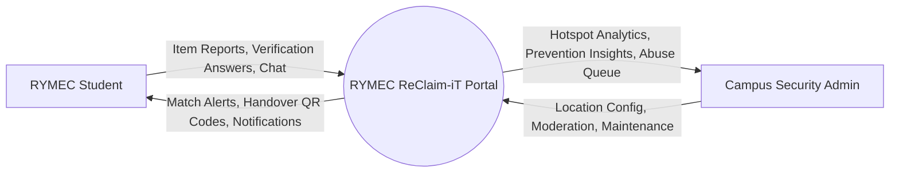
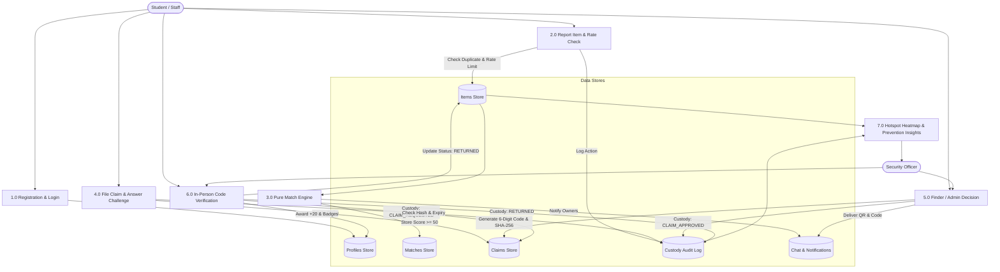

# RYMEC ReClaim-iT: Data Flow Diagrams (DFD)

## Level 0 DFD (Context Diagram)

```mermaid
flowchart LR
    Student[RYMEC Student]
    Security[Campus Security Admin]
    System((RYMEC ReClaim-iT Portal))

    Student -- "Item Reports, Verification Answers, Chat" --> System
    System -- "Match Alerts, Handover QR Codes, Notifications" --> Student

    Security -- "Location Config, Moderation, Maintenance" --> System
    System -- "Hotspot Analytics, Prevention Insights, Abuse Queue" --> Security
```

## Level 1 DFD (Subsystem Data Flow)

```mermaid
flowchart TD
    User([Student / Staff])
    Admin([Security Officer])

    subgraph Data Stores
        D1[(Profiles Store)]
        D2[(Items Store)]
        D3[(Matches Store)]
        D4[(Claims Store)]
        D5[(Custody Audit Log)]
        D6[(Chat & Notifications)]
    end

    %% Process 1: Authentication & Profile Guard
    User --> P1[1.0 Registration & Login]
    P1 --> D1

    %% Process 2: Structured Reporting & U15 Guard
    User --> P2[2.0 Report Item & Rate Check]
    P2 -->|Check Duplicate & Rate Limit| D2
    P2 -->|Log Action| D5

    %% Process 3: Explainable Match Engine (U1)
    D2 --> P3[3.0 Pure Match Engine]
    P3 -->|Store Score >= 50| D3
    P3 -->|Notify Owners| D6

    %% Process 4: Claims & Hidden Challenge (U4)
    User --> P4[4.0 File Claim & Answer Challenge]
    P4 -->|Create Claim| D4
    P4 -->|Custody: CLAIM_REQUESTED| D5

    %% Process 5: Decision & Code Generation (U3)
    User --> P5[5.0 Finder / Admin Decision]
    Admin --> P5
    P5 -->|Generate 6-Digit Code & SHA-256| D4
    P5 -->|Custody: CLAIM_APPROVED| D5
    P5 -->|Deliver QR & Code| D6

    %% Process 6: Handover Verification (U3, U12)
    User --> P6[6.0 In-Person Code Verification]
    Admin --> P6
    P6 -->|Check Hash & Expiry| D4
    P6 -->|Update Status: RETURNED| D2
    P6 -->|Custody: RETURNED| D5
    P6 -->|Award +20 & Badges| D1

    %% Process 7: Admin Analytics & Insights (U10, U11)
    D2 --> P7[7.0 Hotspot Heatmap & Prevention Insights]
    D5 --> P7
    P7 --> Admin
```
